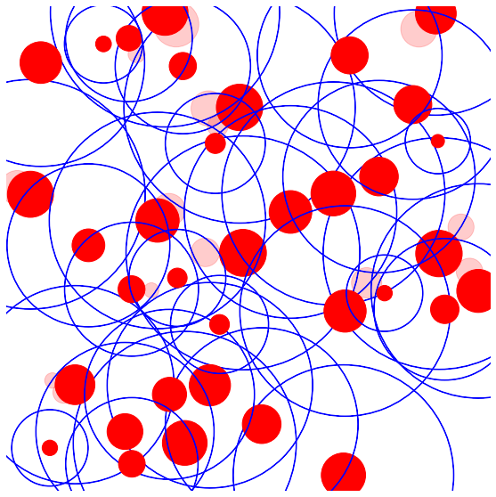
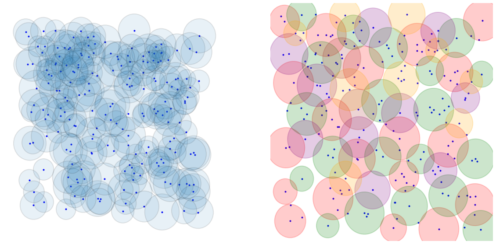
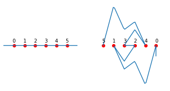
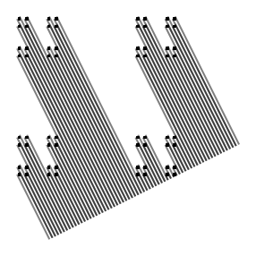
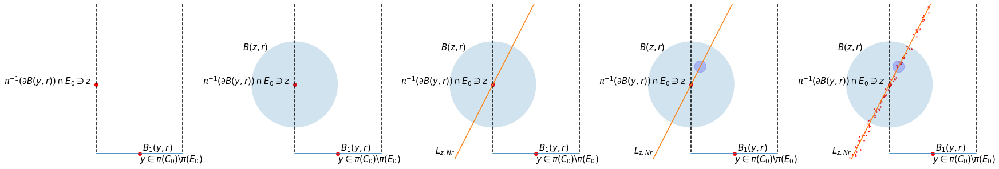
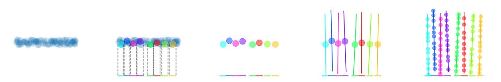

# gmt

In this repository I include the modules and jupyter notebooks I created to make illustrations for my geometric measure theory course in 2021. The commands are essentially convenience functions for plotting shapes using matplotlib, but in an object oriented way so that the code would be more readable and so that I could write code that would resemble the math a bit more. 

For example, I created a Ball class to represent a Euclidean ball. It takes as an arguments in __init__ the center of the ball as some tuple and then its radius, e.g. `B=Ball([0,0],1)`. Plotting the ball to a matplotlib axis object ax is as simple as `B.plot(ax)`, however you can also transform your ball, like translating it by a numpy array v and dilating it by a positive number r to create a new ball object for plotting, e.g. `2*B+np.array([0,1]))` returns the ball object centered at the point [0,1] of radius 2. This makes for Similarly, there's a Cube class for representing cubes of any dimension by specifying a list of intervals whose cartesian product define the cube. If Q is a two dimensional cube (so a square), then you can plot it to an axes object ax via Q.plot(ax), you can dilate it and translate it as above with Ball objects, you can obtain its dyadic children as a list via `Q.children()`, etc.

There are other objects and functions that made making illustrations a lot easier in most cases than drawing them by hand using Inkscape (some were still easier by hand, of course). For example, if you want to come up with a sequence of figures to put in your slides so that moving to the next slide gives the effect of adding new objects onto the figure, then using Python is a much easier route (espcially if you need to tweak the parameters across 5 figures). 

Below are some examples of the figures I made.

Illustrating the 5r-covering Theorem (see Mattila's *Geometry of Sets and Measures in Euclidean Space* Chapter 2):

 

The Besicovitch Covering Theorem  (see Chapter 2 of Mattila)

An illustration of Frostman measures of various dimensions for a line and some random points. 

The Kakeya set constructed as the dual set of a purely unrectifiable set (i.e. Besicovitch's method, see Chapter 18 of Mattila)

Some figures didn't require any interesting objects, just good ol' fashioned numpy. Here is an illustration of a bi-Lipschitz extension of a bi-Lipschitz mapping of a few points in the real line that flips them around (so any extension must wrap around itself in a tight space in order to not self intersect).

This figure shows the 4-corner cantor set and how, for some particular angle, it projects onto an angle (whereas in almost every other direction the shadow has zero length).

The next few figures were used in the proof of Marstrand's Rectifiability Criterion (see Chapter 16 of Mattila). Not only did this require creating sequences of figures, but I also relied on code for the 5r-covering theorem to generate some of the balls that appear in the figures. 

